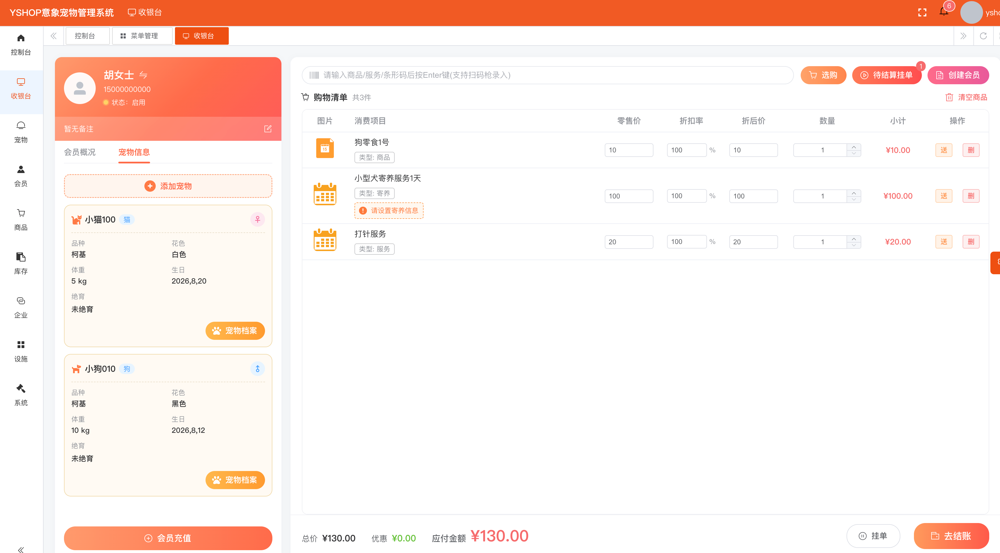
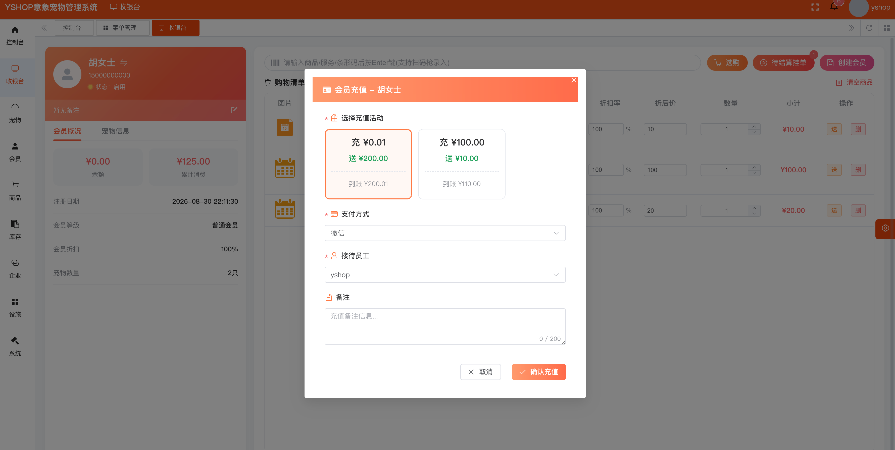
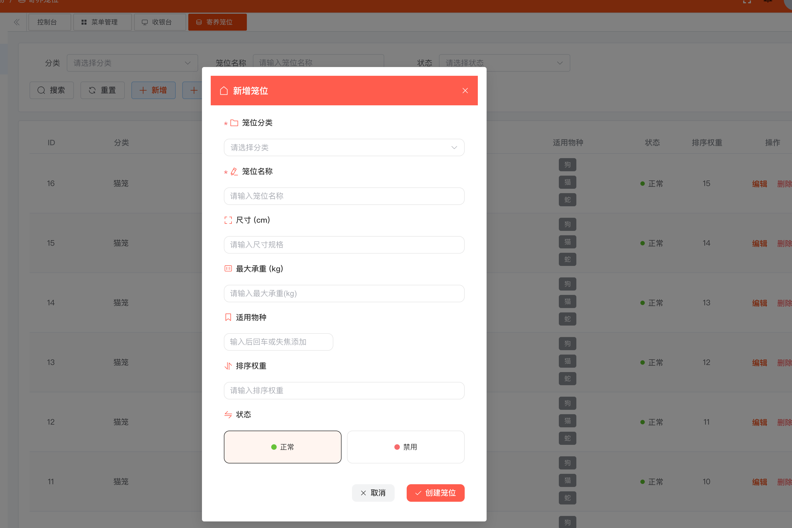
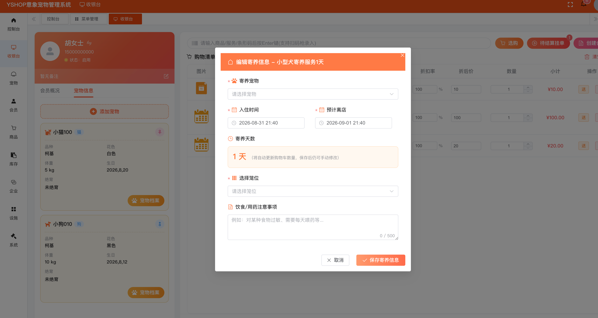
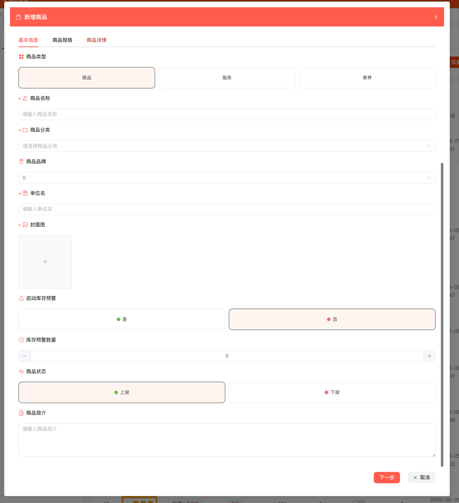
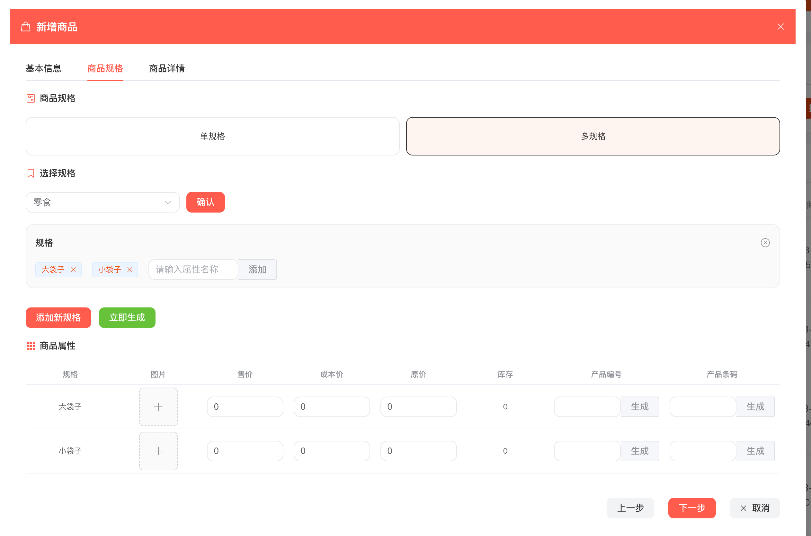
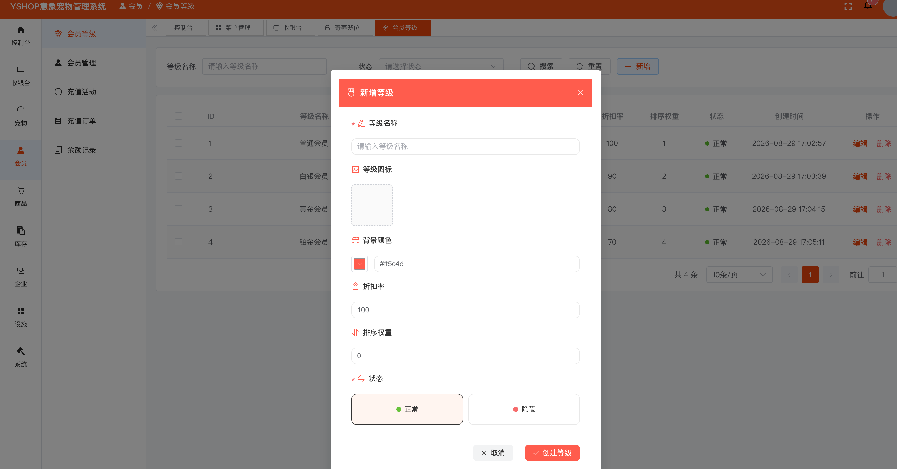

# YSHOP 意象宠物管理系统

> 专为宠物门店打造的数字化经营一站式解决方案，覆盖收银 · 寄养 · 笼位 · 库存 · 会员 · 宠物档案，助力门店实现运营标准化、数字化与高效化。

**官网：** [https://www.yixiang.co/](https://www.yixiang.co/)

---

## 产品简介

YSHOP 意象宠物管理系统是一款专为中小型宠物店打造的经营管理系统，面向宠物门店、宠物服务中心、宠物洗护寄养俱乐部等宠物服务类经营主体量身设计。

系统全面适配宠物门店数字化经营全流程，帮助门店告别社群接单、手写台账等传统低效模式，覆盖服务项目上架、后台一站式收银、笼位状态管控、商品库存管理、会员与宠物档案管理等核心环节，实现业务线上标准化统一管控。

**定位：** 收银 → 寄养 → 笼位 → 库存 → 会员 → 宠物档案

**适用：** 宠物门店（商品零售、洗护美容等综合服务） / 宠物服务中心 / 宠物洗护寄养俱乐部 / 其他宠物服务类经营主体

**核心能力：** 一站式收银台 · 二维矩阵笼位管控 · 寄养登记 · 商品与库存 · 宠物档案 · 会员体系

---

## 核心价值

| 价值 | 说明 |
|------|------|
| 统一管控 | 收银、寄养、笼位、库存、会员、宠物档案集中于同一系统，业务数据互通联动 |
| 降本增效 | 一站式操作界面大幅降低员工学习成本与出错概率，减少人工台账工作量 |
| 状态可视 | 笼位占用、商品库存、会员余额等关键状态实时同步，经营情况一目了然 |
| 留存复购 | 会员等级折扣与充值活动体系，有效提升高价值用户的留存率与复购率 |
| 全程溯源 | 出入库记录、消费记录、余额变动明细完整留痕，经营数据可查可溯 |

---

## 功能列表

| 模块 | 功能 | 业务价值 |
|------|------|----------|
| 一站式收银台 | 扫码收款、会员充值、商品结算、服务核销、寄养登记收费、待结算挂单 | 一个界面完成全部日常收银，降低学习成本与出错概率 |
| 二维矩阵笼位管控 | 笼位分类与档案管理、颜色状态标记、占用状态自动同步 | 笼位使用情况实时可视，避免超卖与空置浪费 |
| 寄养登记 | 寄养宠物登记、入住/离店时间、寄养天数自动计算、笼位分配、饮食用药备注 | 寄养收费与笼位管控一次完成，服务信息不遗漏 |
| 商品与库存管理 | 商品/服务/寄养统一上架、单规格与多规格管理、库存预警、出入库记录溯源 | 无需额外购置进销存系统，日常库存轻松管控 |
| 宠物档案 | 客户信息、宠物品种/花色/体重/生日/绝育情况、累计消费、余额变动明细 | 客户与宠物信息完整沉淀，服务更有针对性 |
| 会员体系 | 会员等级自定义、等级专属折扣、充值赠送活动、余额记录查询 | 提升高价值用户的留存率与复购率 |

---

## 功能详解

### 1. 一站式收银台

集成化操作界面即可完成全部日常收银工作，支持扫码收款、会员充值、商品结算、服务核销、寄养登记收费。

- **扫码录入：** 支持商品、服务、条形码扫码枪录入，输入后按 Enter 键即可快速加入购物清单
- **混合结算：** 商品、服务、寄养项目可在同一购物清单合并结算，自动计算折扣率、折后价与应付金额
- **挂单管理：** 支持待结算挂单与挂单调取，营业高峰可先挂单后结算
- **会员联动：** 结算前可快速创建或切换会员，自动带出会员等级与专属折扣
- **会员充值：** 内置充值赠送活动，支持微信等多种支付方式，充值到账后余额自动更新

### 2. 二维矩阵笼位状态管控

直观展示所有寄养笼位的实时使用情况，通过颜色标记区分空闲与占用状态，系统自动同步更新笼位占用状态。

- **笼位档案：** 支持自定义笼位分类（如猫笼、狗笼），记录尺寸规格、最大承重、适用物种与排序权重
- **状态管理：** 笼位支持正常、禁用状态切换，适用物种标签清晰标注
- **实时同步：** 寄养登记选择笼位后自动标记占用，寄养结束自动释放

### 3. 寄养登记一体化

在收银台即可完成寄养登记全流程，寄养收费与笼位占用一次操作同步完成。

- **信息完整：** 登记寄养宠物、入住时间与预计离店时间，系统自动计算寄养天数并联动购物车数量
- **笼位分配：** 登记时直接选择笼位，自动关联二维矩阵笼位状态管控
- **贴心备注：** 支持记录饮食、用药等注意事项（如食物过敏、需要每天喂药）

### 4. 轻量化商品与库存管理

内置轻量化商品库存管理模块，支持商品出库、盘库、入库登记、库存实时查询与出入库记录溯源。

- **三类项目：** 统一管理商品、服务、寄养三种类型，上架、下架状态灵活控制
- **规格管理：** 支持单规格与多规格商品，可分别设置售价、成本价、原价、库存、产品编号与产品条码
- **库存预警：** 可按商品启动库存预警并设置预警数量，库存不足及时提醒补货
- **记录溯源：** 出入库记录完整留痕，每一笔库存变动都有据可查

### 5. 宠物档案全生命周期

详细记录客户与宠物的核心信息，建立覆盖宠物服务全生命周期的档案体系。

- **客户信息：** 客户姓名、联系方式、会员等级、账户余额、累计消费记录一目了然
- **宠物档案：** 为每只宠物记录品种、花色、体重、生日、绝育情况等信息，支持多只宠物关联同一主人
- **全程追踪：** 累计消费记录、账户余额变动明细完整可查

### 6. 全维度会员体系

支持自定义会员等级，为各等级配置专属折扣权益。

- **等级自定义：** 可自由创建会员等级（如普通、白银、黄金、铂金），配置等级图标与背景颜色
- **折扣权益：** 按等级设置折扣率，收银结算自动生效
- **充值营销：** 充值活动支持「充值赠送」规则配置，吸引会员预存、促进资金回笼
- **余额管理：** 充值订单与余额记录独立可查，每一笔资金变动清晰透明

---

## 演示与咨询

| 入口 | 说明 |
|------|------|
| **官网** | [https://www.yixiang.co/](https://www.yixiang.co/) |

如果对您有帮助，欢迎点右上角 **Star** 支持一下。

QQ 交流群（入群前请先 Star）：**544263002**  
群内有视频教程与开发文档。

---

## 后台截图

### 一站式收银台

| | |
|:---:|:---:|
|  |  |

### 笼位与寄养

| | |
|:---:|:---:|
|  |  |

### 商品与库存

| | |
|:---:|:---:|
|  |  |

### 会员体系

| |
|:---:|
|  |

---

## 系统优势

- **标准化：** 服务上架、收银结算、寄养登记、库存管理全流程线上统一标准，减少对人工经验的依赖
- **数字化：** 客户、宠物、商品、笼位、订单数据全部数字化沉淀，经营决策有据可依
- **高效化：** 一站式操作配合自动化状态同步，门店日常运营效率显著提升
- **易上手：** 界面简洁直观，操作路径短，员工学习成本低、快速上手
- **可追溯：** 消费、充值、库存、寄养记录全程留痕，经营风险可控

---
## 技术栈

**后端：** Spring Boot 3 · Spring Security OAuth2 · MyBatis / MyBatis Plus · Redis · Lombok · Hutool

**前端：** Vue 3 · Element Plus · uni-app（Vue3）

---

## 特别鸣谢

- [ruoyi-vue-pro](https://gitee.com/zhijiantianya/ruoyi-vue-pro)
- [Element Plus](https://element-plus.gitee.io/zh-CN/)
- [Vue](https://cn.vuejs.org/)
- [pay-java-parent](https://gitee.com/egzosn/pay-java-parent)

---

## 开源协议

本项目采用比 Apache 2.0 更宽松的 [MIT License](https://gitee.com/guchengwuyue/crm/blob/master/LICENSE) 开源协议，个人与企业可 100% 免费使用，不用保留类作者、Copyright 信息。
